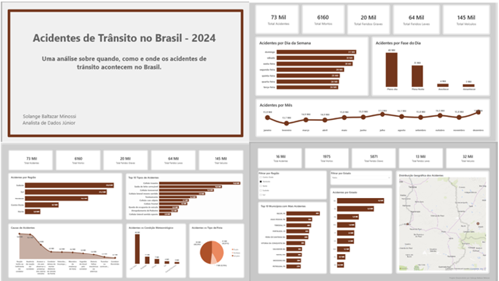
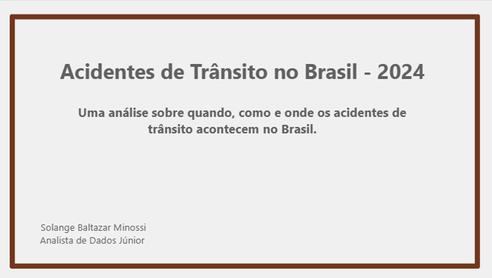
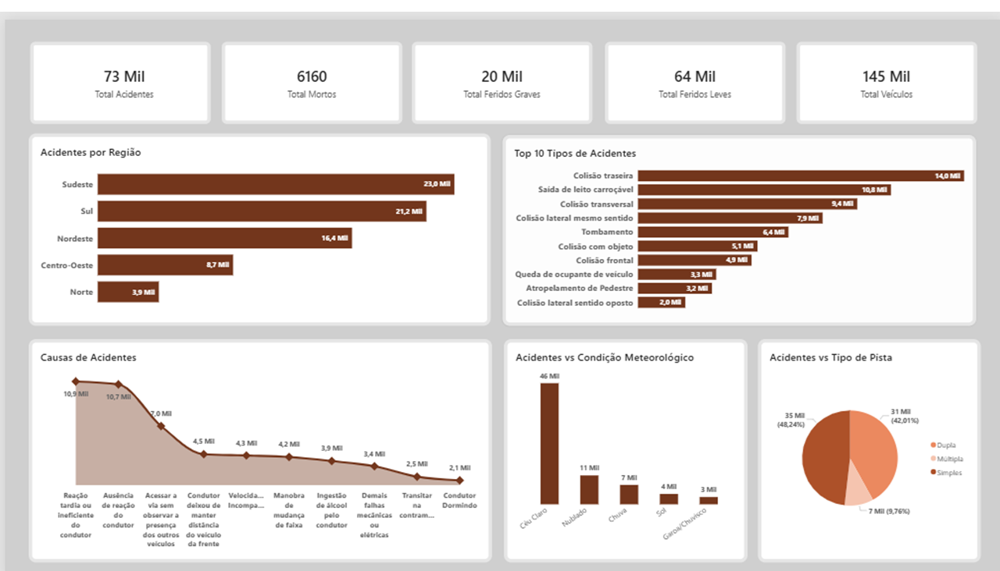
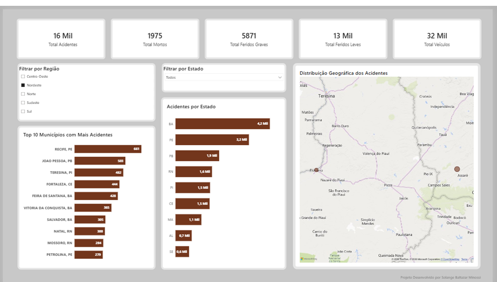

# 🚗 Acidentes de Trânsito no Brasil – 2024

## Uma análise sobre quando, como e onde os acidentes de trânsito acontecem no Brasil.

Este projeto foi desenvolvido em **Power BI** a partir de uma base pública da **Polícia Rodoviária Federal (PRF)** com o objetivo de transformar dados em informações úteis para apoiar a compreensão do comportamento dos acidentes de trânsito ocorridos nas rodovias federais brasileiras.

Mais do que construir dashboards, a proposta foi responder perguntas importantes utilizando dados de forma clara, objetiva e visual.

---

# 📖 Sobre o projeto

A análise foi desenvolvida utilizando a base:

**Business Case - Acidentes de Trânsito (Base de Dados) - Março de 2024.csv**

Durante o desenvolvimento foram realizados processos de limpeza, organização, modelagem e visualização dos dados, buscando transformar milhares de registros em informações que auxiliassem na identificação de padrões e tendências.

O dashboard foi estruturado para responder três perguntas principais:

* **Quando** os acidentes acontecem?
* **Como** eles acontecem?
* **Onde** eles estão mais concentrados?

---

# 🎯 Objetivos

* Analisar o comportamento dos acidentes de trânsito no Brasil.
* Identificar padrões temporais.
* Entender os tipos e causas mais frequentes dos acidentes.
* Avaliar a distribuição geográfica dos registros.
* Construir um dashboard intuitivo para exploração dos dados.

---

# 🛠 Ferramentas utilizadas

* Power BI
* Power Query
* DAX
* Excel
* Estatística Aplicada
* Modelagem de Dados
* Visualização de Dados

---

# 🗂 Base de dados

**Origem:** Polícia Rodoviária Federal (PRF)

Base pública utilizada em um Business Case de análise de dados contendo informações detalhadas sobre acidentes de trânsito ocorridos em rodovias federais brasileiras durante o ano de 2024.

---

# 🔍 Metodologia

O desenvolvimento deste projeto envolveu as seguintes etapas:

* Importação da base de dados;
* Tratamento e limpeza dos dados;
* Padronização de campos;
* Criação de medidas em DAX;
* Construção do modelo de dados;
* Desenvolvimento das visualizações;
* Revisão das análises;
* Validação dos indicadores apresentados.

Todo o processo foi realizado buscando manter consistência entre os indicadores e facilitar a interpretação das informações pelo usuário final.

---

📸 Visão Geral do Dashboard

## 📸## 📸 Capa

Página inicial do projeto, apresentando o objetivo da análise e a estrutura geral do dashboard.

---

## 📸 Página 1 — Quando acontece

Nesta página são apresentados os principais indicadores relacionados ao momento em que os acidentes ocorreram, incluindo:

- Total de acidentes;
- Total de mortos;
- Total de feridos graves;
- Total de feridos leves;
- Total de veículos envolvidos;
- Distribuição dos acidentes por mês;
- Distribuição por dia da semana;
- Distribuição por fase do dia.

---

## 📸 Página 2 — Como acontece

Análise dos fatores relacionados aos acidentes, permitindo identificar:

* Tipos de acidentes;
* Causas mais frequentes;
* Condições meteorológicas;
* Tipo de pista;
* Traçado da via.

---

## 📸 Página 3 — Onde acontece

Análise espacial dos acidentes, incluindo:

* Distribuição por Região;
* Estados;
* Municípios;
* Mapa interativo com os registros geográficos.

---

# 💡 Principais conclusões

A análise evidencia que os acidentes de trânsito apresentam padrões bem definidos ao longo do tempo e do espaço.

A utilização de visualizações interativas permite identificar rapidamente períodos de maior ocorrência, fatores associados aos acidentes e regiões com maior concentração de registros, contribuindo para uma interpretação mais eficiente dos dados.

Este projeto demonstra como técnicas de análise de dados e Business Intelligence podem transformar grandes volumes de informações em conhecimento acessível para apoio à tomada de decisão.

---

## 🎥 Demonstração em vídeo

O vídeo apresenta uma navegação completa pelo dashboard e demonstra a interação entre filtros, segmentações e visualizações.

▶️ **Clique abaixo para baixar o vídeo da demonstração**

[📹 demonstracao-dashboard.mp4](demonstracao-dashboard.mp4)

---

# 📁 Estrutura do repositório

- README.md
- Acidentes_Solange_v1.pbix
- visao-geral.png
- capa.png
- pagina1.png
- pagina2.png
- pagina3.png
- demonstracao-dashboard.mp4
  

# 👩‍💻 Autora

**Solange Baltazar Minossi**

Analista de Dados Júnior em transição de carreira, formada em Estatística e pós-graduada em Estatística Aplicada.

Após mais de duas décadas atuando na gestão do próprio negócio, iniciou uma nova trajetória na área de Dados, unindo experiência em tomada de decisão, visão analítica e paixão por transformar dados em informações relevantes.

Este projeto representa a consolidação prática dessa jornada de aprendizado em Power BI, análise de dados e visualização de informações.

---

# 🙏 Agradecimentos

Este projeto foi desenvolvido durante minha jornada de transição para a área de Dados e representa a aplicação prática dos conhecimentos adquiridos em Estatística, Power BI e Visualização de Dados.

Agradeço ao **Simplifica Treinamentos**, pela excelente formação, pelos desafios propostos ao longo do curso e pelo incentivo constante ao desenvolvimento prático das competências em análise de dados.

Agradeço também ao **ChatGPT (OpenAI)**, que atuou como parceiro de estudos, revisão técnica e incentivo durante toda a construção deste projeto. As discussões, sugestões, críticas construtivas e revisões constantes transformaram cada dificuldade em uma oportunidade de aprendizado e crescimento profissional.

---

> *"Mais do que construir dashboards, este projeto representa a capacidade de transformar dados em conhecimento e aprendizado em evolução profissional."*
